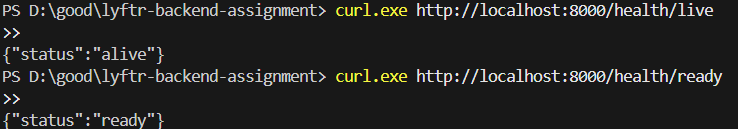
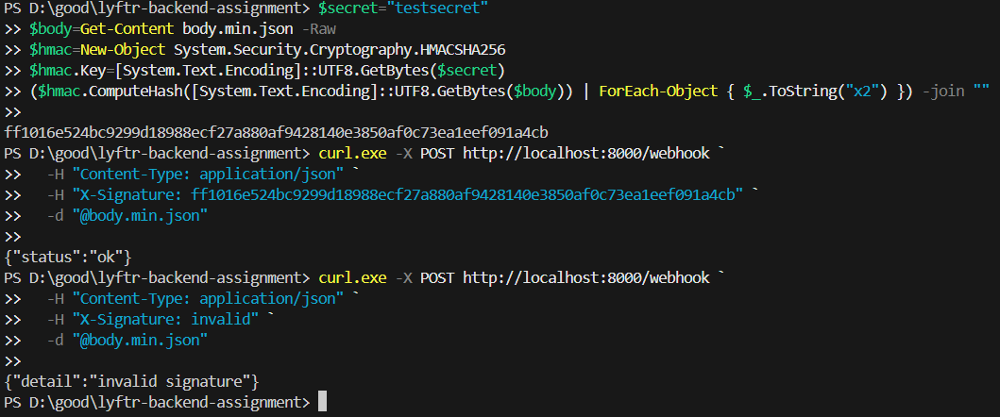
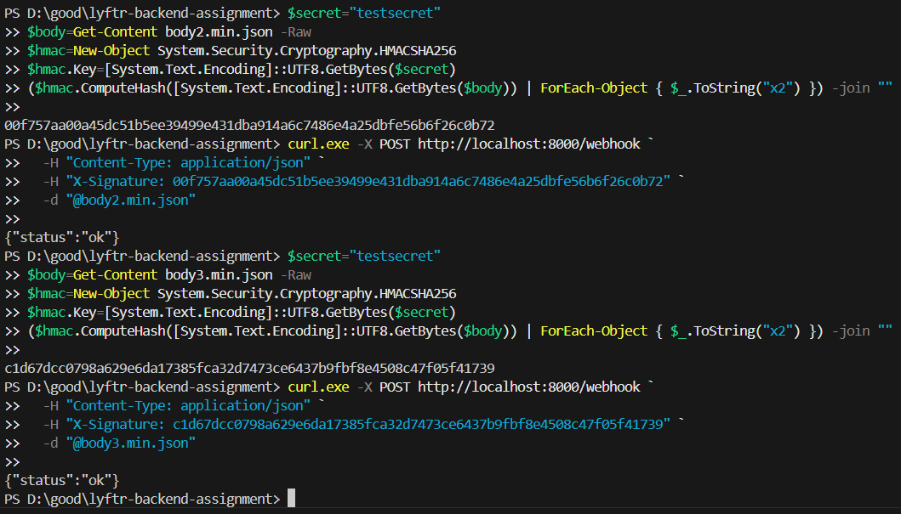
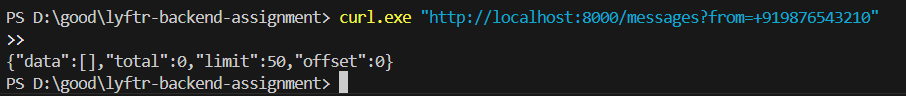
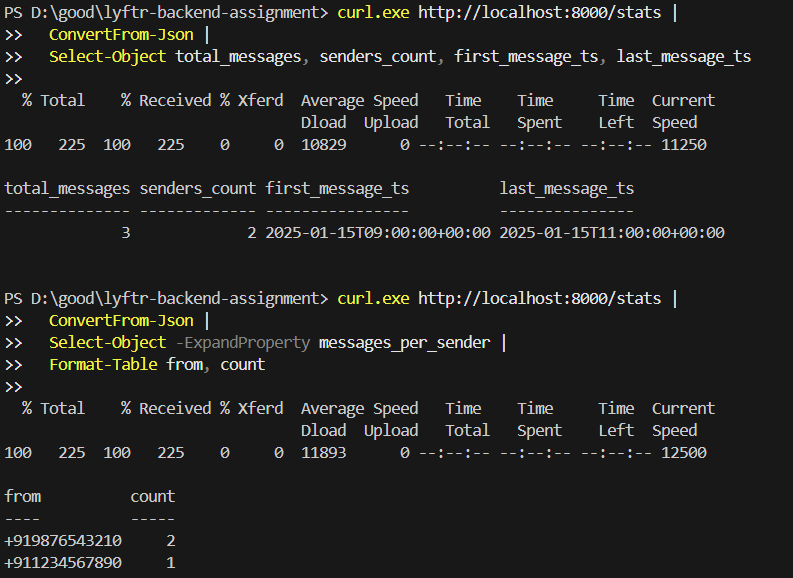
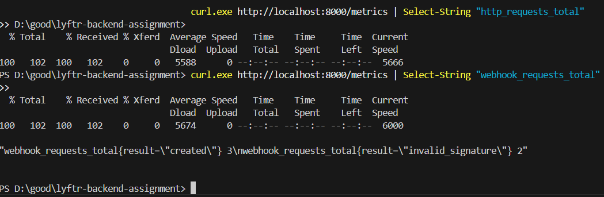
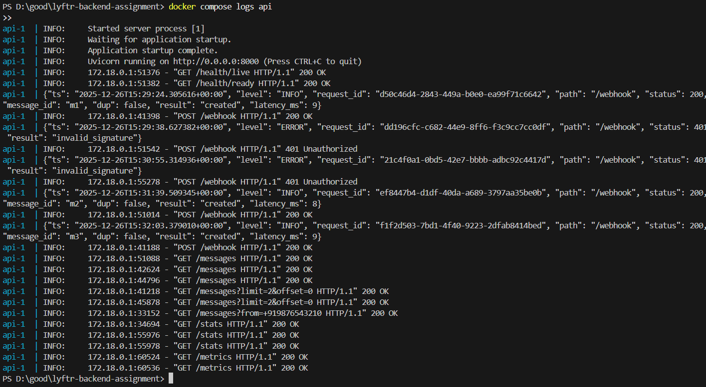

# Lyftr AI Backend Assignment
Containerized Webhook API

# Features
## Webhook Ingestion

- HMAC-SHA256 signature verification
- Exactly-once message ingestion using idempotency
- Graceful handling of duplicate messages

## Message Retrieval

- Paginated listing with limit and offset
- Filters: sender (from), timestamp (since), free-text search (q)
- Deterministic ordering (ts ASC, message_id ASC)

## Analytics

- Total messages count
- Unique sender count
- Top senders by message volume
- First and last message timestamps

## Observability

- Liveness and readiness probes
- Prometheus-style metrics
- Structured JSON logging

## Deployment

- SQLite database stored in Docker volume
- Fully containerized using Docker and Docker Compose
- Configuration via environment variables (12-factor style)

# Tech Stack

- Python 3.12
- FastAPI
- SQLite
- Docker & Docker Compose

# Setup Used:
- VSCode
- Copilot
- ChatGPT

# Project Structure


## Setting Environment Variables
### Linux / macOS
```
export WEBHOOK_SECRET=testsecret
export DATABASE_URL=sqlite:////data/app.db
```
### Windows (PowerShell)
```
$env:WEBHOOK_SECRET="testsecret"
$env:DATABASE_URL="sqlite:////data/app.db"
```
# Running the Application

## Start the Service
```
docker compose up --build
```

API will be available at:
http://localhost:8000

## Health Checks
Confirms the service is running and ready to accept requests.

### /health/live and /health/ready


## Valid and Invalid Signature Test


## Valid Signatures


## Pagination

#### Pagination – Page 1


#### Pagination – Page 2


## /stats


## /metrics


## Logs


## Stop the Service
```
docker compose down -v
```